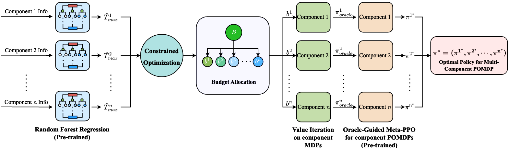
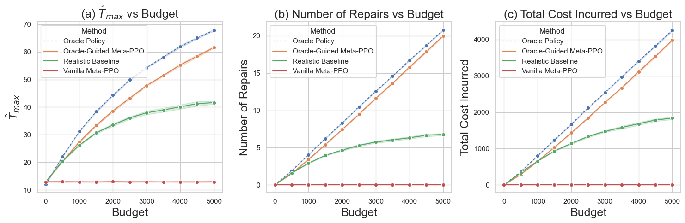
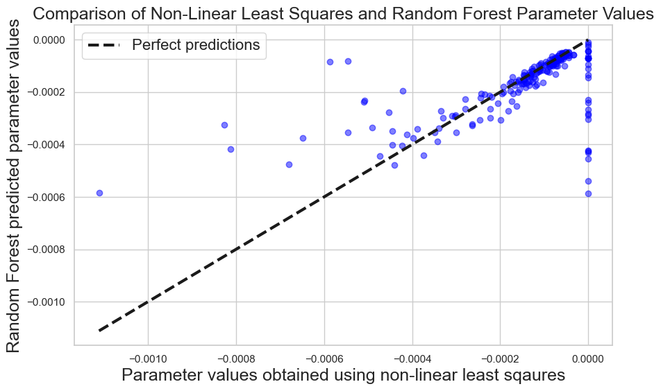
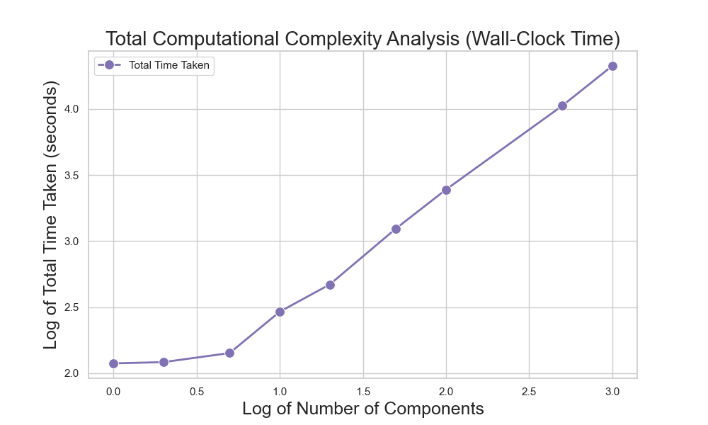

<div align="center">

# 🎯 Oracle-Guided Meta-PPO

**A Scalable Two-Stage Reinforcement Learning Framework for Multi-Agent Budget-Constrained POMDPs**

[](https://arxiv.org/abs/2408.07192)
[](https://www.python.org/downloads/)
[](https://pytorch.org/)
[](https://stable-baselines3.readthedocs.io/)
[](https://opensource.org/licenses/MIT)

**[[Paper]](https://arxiv.org/abs/2408.07192)** · **[[PDF]](https://arxiv.org/pdf/2408.07192)**

</div>

---

## Table of Contents

- [Overview](#-overview)
- [Method](#-method)
- [Results](#-results)
- [Repository Structure](#-repository-structure)
- [Installation](#-installation)
- [Usage](#-usage)
- [Experiments](#-experiments)
- [Application Domains](#-application-domains)
- [Citation](#-citation)

---

## 🌟 Overview

Oracle-Guided Meta-PPO addresses the challenge of training reinforcement learning policies for **large-scale multi-agent systems** with:
- 📊 **Budget constraints** across all agents
- 👁️ **Partial observability** (POMDP setting)
- 🔄 **Heterogeneous agent dynamics**

The key insight is to leverage computationally tractable **oracle policies** (computed via value iteration on a surrogate MDP) to guide the training of a **meta-policy** that generalizes across diverse agent configurations.

### ✨ Key Features

| Feature | Description |
|---------|-------------|
| 🚀 **Scalability** | Efficiently handles up to 1,000 heterogeneous agents |
| 🎓 **Generalization** | Meta-policy trained on small subset generalizes to unseen configurations |
| 🔮 **Oracle Guidance** | MDP-based oracles accelerate POMDP policy learning |
| ⚡ **Two-Stage Design** | Decouples budget allocation from policy learning |

---

## 🔬 Method

The proposed approach consists of **three main stages**:

<div align="center">

</div>

*Overview of the Oracle-Guided Meta-PPO pipeline: (1) Random Forest predicts optimal budget allocation, (2) Value iteration generates oracle policies for each agent-budget pair, (3) Meta-PPO learns when to follow the oracle vs. gather information.*

### Stage 1: Budget Allocation via Random Forest
A Random Forest regressor learns to predict optimal per-agent budget allocations based on agent-specific features (degradation dynamics, costs, etc.).

### Stage 2: Oracle Policy Generation
For each agent-budget pair, an oracle policy is computed via **value iteration** on a surrogate MDP with full state observability.

### Stage 3: Oracle-Guided Meta-PPO Training
A PPO-based meta-policy is trained with a hierarchical action space:
- **Action 0**: Follow the oracle policy's recommendation
- **Action 1**: Take an inspection action to reduce uncertainty

This design allows the policy to focus on the core POMDP challenge: *when to gather information*.

---

## 📈 Results

### Performance Comparison

Our Oracle-Guided Meta-PPO achieves near-oracle performance while operating under partial observability:

<div align="center">

</div>

*Comparison across three metrics: (a) Maximum lifetime achieved, (b) Number of repair actions, (c) Total cost incurred. Oracle-Guided Meta-PPO (orange) closely tracks the oracle policy (blue dashed) and significantly outperforms Vanilla Meta-PPO (red) and rule-based baselines (green).*

### Budget Allocation via Random Forest

The Random Forest regressor accurately predicts optimal budget allocation parameters:

<div align="center">

</div>

*Random Forest predictions closely match ground-truth parameters obtained via non-linear least squares optimization.*

### Computational Scalability

The framework demonstrates practical scalability:

<div align="center">

</div>

*Total computation time vs. number of components (log-log scale). The algorithm efficiently scales to 1,000 agents.*

---

## 🗂️ Repository Structure

```
Oracle-Guided-Meta-PPO/
│
├── 📁 infra_env/                      # Infrastructure Management Scenario
│   ├── 📁 env/                        # Environment definitions
│   │   ├── component_mdp_repair.py    # MDP formulation
│   │   ├── component_pomdp_repair.py  # POMDP with belief tracking
│   │   ├── meta_ppo_env.py            # Meta-PPO environment wrapper
│   │   └── baseline_env.py            # Baseline environment
│   │
│   └── 📁 pomdp_solver/               # Core algorithms
│       ├── random_forest.py           # RF model training
│       ├── random_forest_budget_split.py
│       ├── generate_oracle_policies.py
│       ├── oracle_guided_meta_ppo_train.py
│       ├── oracle_guided_meta_ppo_test.py
│       ├── vanilla_meta_ppo_*.py      # Baseline
│       ├── realistic_baseline.py      # Rule-based baseline
│       └── time_complexity.py         # Scalability experiments
│
├── 📁 etf_env/                        # ETF Risk Capital Management
│   ├── 📁 env/                        # Environment definitions
│   ├── 📁 models/                     # ML models
│   ├── etf_oracle_guided_meta_ppo.py
│   └── ...
│
├── 📁 assets/                         # Images for README
├── 📄 requirements.txt
├── 📄 .gitignore
└── 📄 README.md
```

---

## 🚀 Installation

### Prerequisites
- Python 3.8+
- pip or conda

### Quick Start

```bash
# Clone the repository
git clone https://github.com/Manavvora/Oracle-Guided-Meta-PPO.git
cd Oracle-Guided-Meta-PPO

# Create virtual environment (recommended)
python -m venv venv
source venv/bin/activate  # Windows: venv\Scripts\activate

# Install dependencies
pip install -r requirements.txt
```

---

## 💻 Usage

### Infrastructure Management Scenario

```bash
cd infra_env/pomdp_solver

# Step 1: Train Random Forest for budget prediction
python random_forest.py

# Step 2: Compute budget split
python random_forest_budget_split.py --num_components 1000

# Step 3: Generate oracle policies
python generate_oracle_policies_optimal_budget_split.py --num_components 1000

# Step 4: Train Oracle-Guided Meta-PPO
python oracle_guided_meta_ppo_train.py

# Step 5: Evaluate
python oracle_guided_meta_ppo_optimal_budget_split.py --num_components 1000
```

### ETF Risk Capital Management

```bash
cd etf_env

# Train
python etf_oracle_guided_meta_ppo.py --timesteps 100000

# Test
python oracle_guided_ppo_test.py
```

### Run Scalability Experiments

```bash
cd infra_env/pomdp_solver
python time_complexity.py
```

---

## 📊 Experiments

### Baselines

| Method | Description |
|--------|-------------|
| **Oracle Policy** | Upper bound - MDP policy with full observability |
| **Vanilla Meta-PPO** | Standard meta-PPO without oracle guidance |
| **Realistic Baseline** | Rule-based inspection/replacement policy |
| **Equal Budget Split** | Uniform budget allocation |

### Evaluation Metrics

- **Time-to-Failure (TTF)**: Average operational lifetime
- **Total Cost Incurred**: Cumulative maintenance costs  
- **Action Distribution**: Frequency of inspect/replace/no-action

---

## 🌐 Application Domains

### 🏗️ Infrastructure Management
| Aspect | Details |
|--------|---------|
| **Problem** | Managing degradation of infrastructure components |
| **State** | Component health (partially observable) + budget consumed |
| **Actions** | No-op, Inspect, Replace |
| **Objective** | Maximize lifetime within budget |

### 📈 ETF Risk Capital Management
| Aspect | Details |
|--------|---------|
| **Problem** | Managing risk capital across financial assets |
| **State** | Asset prices (observable) + risk levels (partial) |
| **Actions** | No-op, Inspect, Recapitalize |
| **Objective** | Maximize portfolio survival |

---

## 📦 Dependencies

| Package | Purpose |
|---------|---------|
| `stable-baselines3` | PPO implementation |
| `gymnasium` | RL environment interface |
| `scikit-learn` | Random Forest model |
| `cvxpy` | Convex optimization |
| `numpy`, `pandas` | Data manipulation |
| `matplotlib`, `seaborn` | Visualization |

---

## 📄 Citation

If you find this work useful, please cite our paper:

```bibtex
@article{vora2024solving,
  title={Solving truly massive budgeted monotonic pomdps with oracle-guided meta-reinforcement learning},
  author={Vora, Manav and Liang, Jonas and Grussing, Michael N and Ornik, Melkior},
  journal={arXiv preprint arXiv:2408.07192},
  year={2024}
}
```

---

## 📄 License

This project is licensed under the MIT License - see the [LICENSE](LICENSE) file for details.

---

## 🙏 Acknowledgments

This work builds upon:
- [Stable-Baselines3](https://github.com/DLR-RM/stable-baselines3) for RL algorithms
- [Gymnasium](https://gymnasium.farama.org/) for environment interfaces

---

<div align="center">

**⭐ If you find this work useful, please consider giving it a star! ⭐**

</div>
